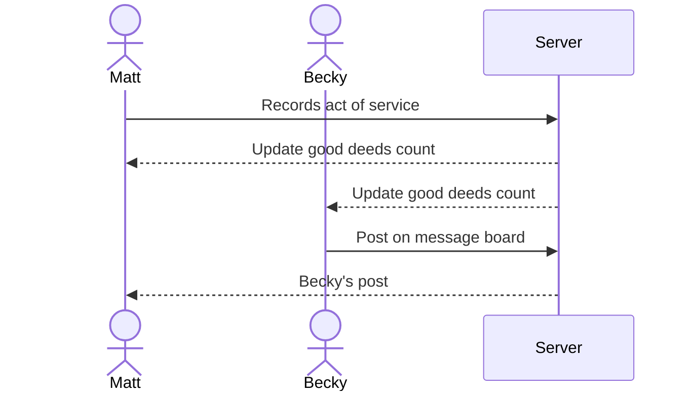

# Ripple

A community oriented web applicated indented to promote acts of service and goodwill. Ripple provides daily inspiration for good deeds and hosts a community message board where users can advertise service opportunities. The code for the web-app itself is located in `startup/`

### Elevator pitch

Do you want to help the world become a better place, but just feel overwhelmed by how much needs to be accomplished? The Ripple application provides daily inspiration for simples acts of service that can be seemlessly integrated into your normal routine. When you complete an act of service, you can mark it done to update a running count of good deeds and record your experience in a digital journal. Additionally, if you are aware of service opportunities in your community, you can post on a community message board to raise awareness of that need. The message board is upadated in realtime to provide users with easy access to the most recent and relavent information. 

### Design

Sequence diagram depicting how users interact with backend.

### Key features

- Secure login over HTTPS
- Display daily service inspiration on homepage
- Display total acts of service by all users and today's total on homepage
- Display current daily streak for the user
- Ability to mark an act of service completed
- Update service totals in realtime
- Ability to record service experience in a digital journal
- Digital journal data stored and retrivable
- Ability to veiw service opportunities on community message board 
- Ability to post about service opportunites on the message board
- Message board updated in realtime with each new post

### Technologies

I am going to use the required technologies in the following ways.

- **HTML** - Using correct HTML structure, this application will have four HTML pages. The homepage (where daily service inpsiration is displayed), a second for login, a third for the digitial journal, and a fourth for the community message board.
- **CSS** - Application styling that allows easy veiwing on all screen sizes, maintaining good whitespace, readablity, and functional element access.
- **React** - Provides functionality for login, marking good deeds completed, displaying good deeds total, and backend endpoint calls.
- **Service** - Backend sercice with endpoints for:
    - Register, login, and logout users. Credentials securely stored in database. Users cannot create journal entries or posts unless authenticated.
    - Creating digital journal entries.
    - Retriving digital journal contents.
    - Creating message boarrd posts.
    - Retriving message board posts.
- **DB/Login** - Store login infromation, users, journal entries, and community posts in database.
- **WebSocket** - Whenever a user marks the daily service inspiration complete, the total and daily good deeds counters will be updated and boarcast to all users. Whenever a user posts about a service opportunity to the message board, that new post will be boardcast to all users.

## 🚀 Specification Deliverable

For this deliverable I did the following. I checked the box `[x]` and added a description for things I completed.

- [x] I completed the prerequisites for this deliverable (Git commit requirement)
- [x] Proper use of Markdown
- [x] A concise and compelling elevator pitch
- [x] Description of key features
- [x] Description of how you will use each technology
- [x] One or more rough sketches of your application. Images must be embedded in this file using Markdown image references.

## 🚀 AWS deliverable

For this deliverable I did the following. I checked the box `[x]` and added a description for things I completed.

- [x] **Rented EC2 server** - Rented a t.3nano
- [x] **Leased domain name** - leased the domain "rippleeffect.click"
- [x] **Server accessible** from my domain: https://rippleeffect.click

## 🚀 HTML deliverable

For this deliverable I did the following. I checked the box `[x]` and added a description for things I completed.

- [x] I completed the prerequisites for this deliverable (Simon deployed, GitHub link, Git commits)
- [x] **HTML pages** - I create four html pages (Login, Home, Journal, Community).
- [x] **Proper HTML element usage** - All html structure is syntactically correct.
- [x] **Links** - I provided links to connect my webpages, and a link to my GitHub.
- [x] **Text** - Each webpage has displayed text.
- [x] **3rd party API placeholder** - Added placeholder refference to an inspirational qoute API to index.html.
- [x] **Images** - Image present at the top of each page.
- [x] **Login placeholder** - Added a placeholder user display on non-login pages.
- [x] **DB data placeholder** - Added placeholder refference to DB data on both community.html and journal.html.
- [x] **WebSocket placeholder** - Added Websocket placholder refference to home.html.

## 🚀 CSS deliverable

For this deliverable I did the following. I checked the box `[x]` and added a description for things I completed.

- [x] I completed the prerequisites for this deliverable (Simon deployed, GitHub link, Git commits)
- [x] **Visually appealing colors and layout. No overflowing elements.** - I went with a pink main, and from my end there are no overflowing elements.
- [x] **Use of a CSS framework** - I used BootStrap.
- [x] **All visual elements styled using CSS** - All visual elements are in someway affected by CSS.
- [x] **Responsive to window resizing using flexbox and/or grid display** - I used both flex and/or grid depending on the web element.
- [x] **Use of a imported font** - I used the "Playfair Display" imported from google fonts.
- [x] **Use of different types of selectors including element, class, ID, and pseudo selectors** - I used all four selector types.

## 🚀 React part 1: Routing deliverable

For this deliverable I did the following. I checked the box `[x]` and added a description for things I completed.

- [x] I completed the prerequisites for this deliverable (Simon deployed, GitHub link, Git commits)
- [X] **Bundled using Vite** - I bundled using Vite.
- [X] **Components** - I created the App component, and an individual component for each webpage.
- [X] **Router** - I successfully implemented the router.

## 🚀 React part 2: Reactivity deliverable

For this deliverable I did the following. I checked the box `[x]` and added a description for things I completed.

- [X] I completed the prerequisites for this deliverable (Simon deployed, GitHub link, Git commits)
- [x] **All functionality implemented or mocked out** - I mocked out all planned functionality for API, WebSocket, and DB access.
- [x] **Hooks** - I used both .useState and .useEffect

## 🚀 Service deliverable

For this deliverable I did the following. I checked the box `[x]` and added a description for things I completed.

- [x] I completed the prerequisites for this deliverable (Simon deployed, GitHub link, Git commits)
- [x] **Node.js/Express HTTP service** - Backend Express completed.
- [x] **Static middleware for frontend** - Static middleware completed.
- [x] **Calls to third party endpoints** - Third part call to ZenQuotes completed.
- [x] **Backend service endpoints** - Backend service endpoint completed.
- [x] **Frontend calls service endpoints** - Frontend calls to service endoints completed.
- [x] **Supports registration, login, logout, and restricted endpoint** - Registration, login, logout and restricted endpoints completed.
- [x] **Uses BCrypt to hash passwords** - Use of BCrypt to hash passwords completed.

## 🚀 DB deliverable

For this deliverable I did the following. I checked the box `[x]` and added a description for things I completed.

- [x] I completed the prerequisites for this deliverable (Simon deployed, GitHub link, Git commits)
- [x] **Stores data in MongoDB** - Data for both user and global stats, daily deeds, community posts, and individual users journals all store in mongodb.
- [x] **Stores credentials in MongoDB** - User credenitals (email, password, and authentication cookies) store in the mongodb.

## 🚀 WebSocket deliverable

For this deliverable I did the following. I checked the box `[x]` and added a description for things I completed.

e- [x] I completed the prerequisites for this deliverable (Simon deployed, GitHub link, Git commits)
- [x] **Backend listens for WebSocket connection** - Backend listens for connection to WebSocket Server.
- [x] **Frontend makes WebSocket connection** - Frontend adds itself to WebSocket Clients.
- [x] **Data sent over WebSocket connection** - Global Stats and new Community Posts sent over WebSocket connection.
- [x] **WebSocket data displayed** - Gloabl Stat displays updated on home page. New post displayed to all users, and new post notification sent to all other users.
- [x] **Application is fully functional** - All other deliverables completed. Mock functionality removed.
